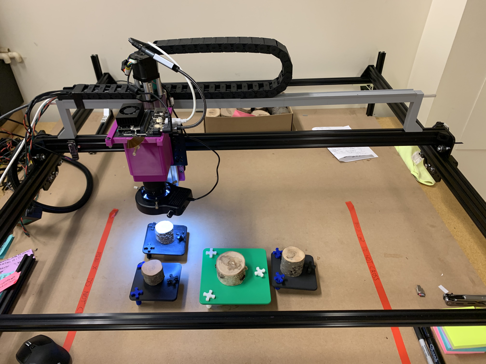
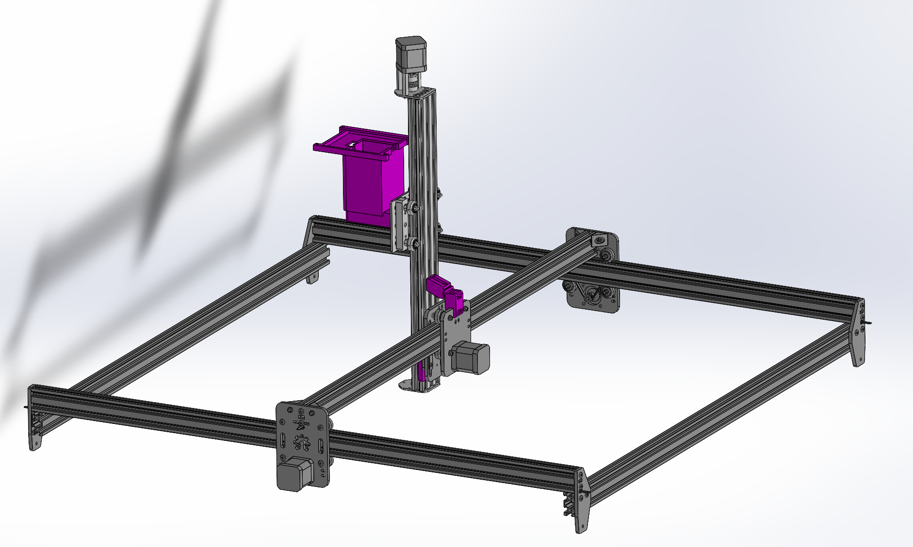
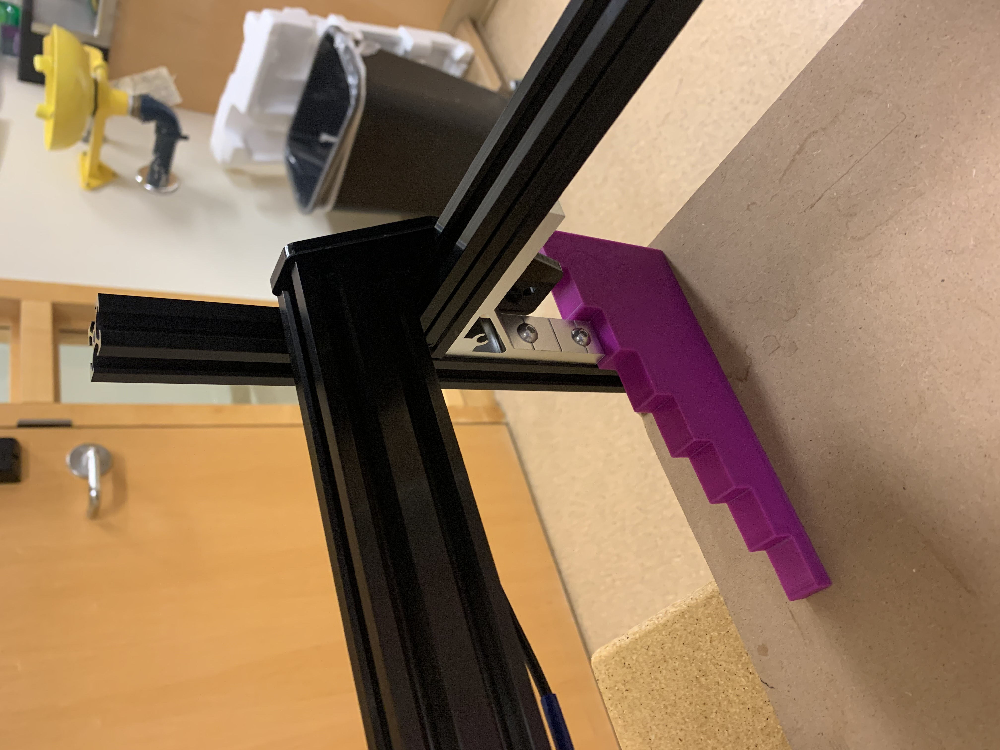
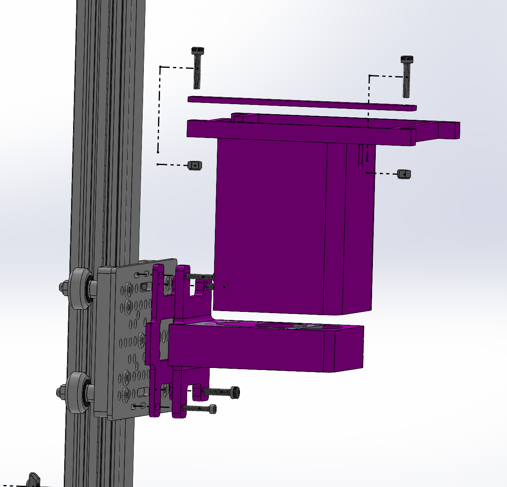
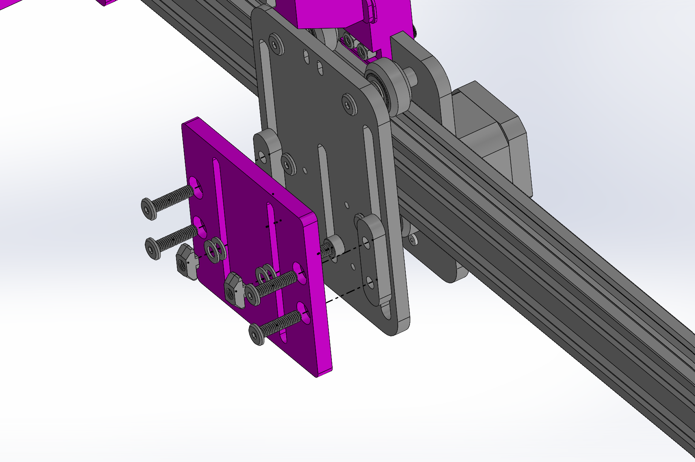
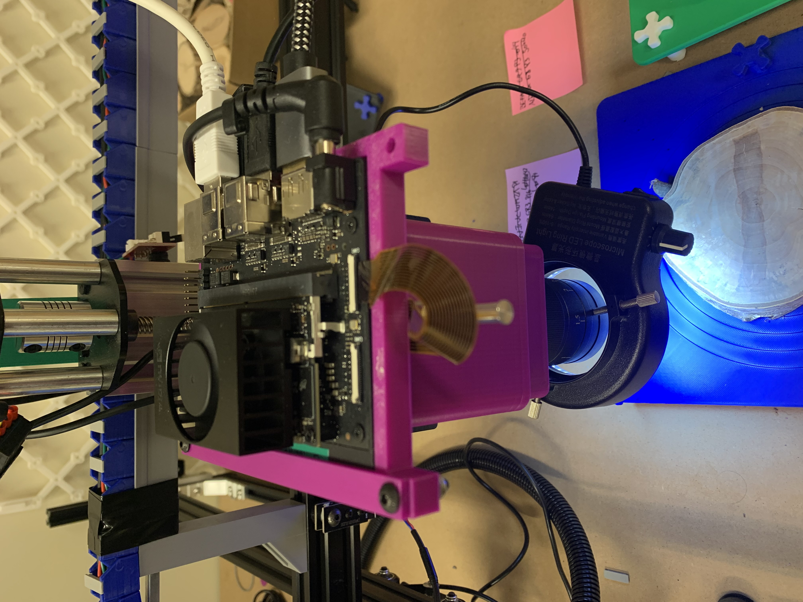
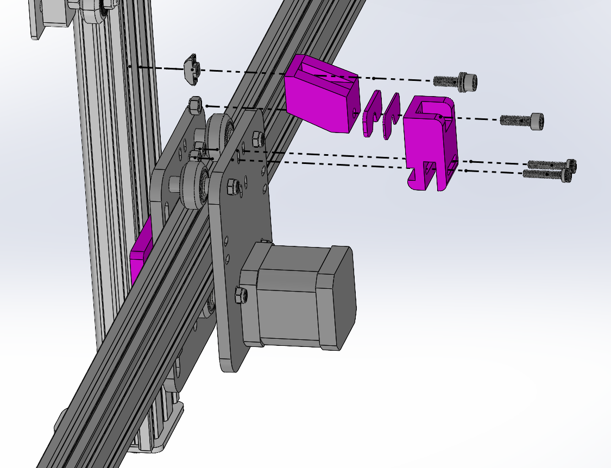
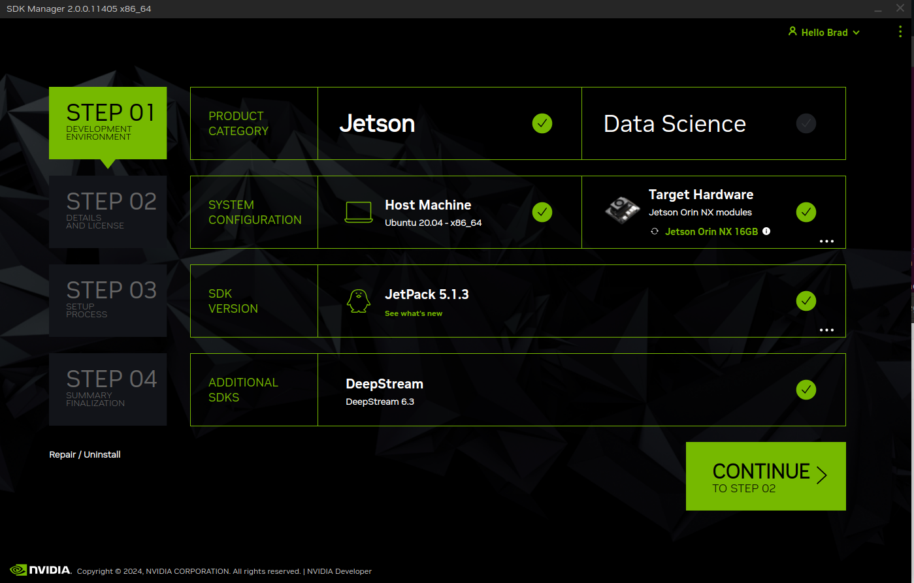

# TreeRings

The TreeRings project is under development by students in the Temporal Ecology Lab at UBC. The project aims to create an open source and reproducible system to digitize ultra high resolution images of tree cookies. This is accomplished with a robot having control of a microscope camera that can navigate the X, Y, and Z directions. By systematically capturing images across the surface of the cookie, it is possible to stitch subframes of the cookie together into one large mosaic with the help of feature matching techniques.

While this was designed to capture tree cookies, in theory this should also be able to be used to scan other planar objects such as planed mineral samples or pencil drawings.

## Current Functionality



- Image capture and stitching of the surface of a tree cookie into a single mosaic
- Memory efficient image stitching (stitching images greater than available device RAM)
- Multiple mosaic resolutions for one set of images
- Data storage in .dat files to be used with a custom image viewer to view a subset of the image without loading into RAM

## Current Limitations

- Larger cookies (> 25cm in diameter) are more difficult to sand uniformly, resulting in poor stitching

## Getting Started

To get a TIM of your own, you'll have to acquire the materials itemized below.

## Step 1. Materials / Equipment

| Item                                                                                                                                                                                                                                                                                                                                                                                                                                                                                                                      | Description                                                                                                                                                                                                                                                                                                                                                                                                                                                                                                      | Cost per unit CAD   | Material Type |
| ------------------------------------------------------------------------------------------------------------------------------------------------------------------------------------------------------------------------------------------------------------------------------------------------------------------------------------------------------------------------------------------------------------------------------------------------------------------------------------------------------------------------- | ---------------------------------------------------------------------------------------------------------------------------------------------------------------------------------------------------------------------------------------------------------------------------------------------------------------------------------------------------------------------------------------------------------------------------------------------------------------------------------------------------------------- | ------------------- | ------------- |
| FDM 3D Printer                                                                                                                                                                                                                                                                                                                                                                                                                                                                                                            | Many components are 3D printed to allow for rapid prototyping. Printing quality varies across platforms and materials. Choose what is best for your lab - our parts were made with a [Bambu Carbon X1](https://ca.store.bambulab.com/products/x1-carbon?variant=46286179270896&currency=CAD&utm_medium=product_sync&utm_source=google&utm_content=sag_organic&utm_campaign=sag_organic&gad_source=1&gclid=Cj0KCQjww5u2BhDeARIsALBuLnPN2AA2AAOx9SfhR0Slt6G1aFqrriQxQIsDFw2W-HsvmBLvWzmlFU4aAoNQEALw_wcB) printer. Ordering 3D prints should also be possible at your university or through many online services. | $1900               | Equipment     |
| [Jetson Orin Nano](https://www.seeedstudio.com/NVIDIAr-Jetson-Orintm-Nano-Developer-Kit-p-5617.html?gad_source=1&gclid=Cj0KCQjww5u2BhDeARIsALBuLnM4tGqXsBM7JNxW5mwzGraFG74Qjp_JeM_HpbXGEc9Mlnl9b1s2fv8aAsPREALw_wcB)                                                                                                                                                                                                                                                                                                      | This acts as the main computing device, running the GUI, stitching software, driving the camera, etc.                                                                                                                                                                                                                                                                                                                                                                                                            | $879                | Computer      |
| 32 GB Fast SD Card | For loading system image onto Jetson. (We have 256 GB, is this necessary?) | $50 | Computer |
| [1 TB NVME SSD](https://www.amazon.ca/dp/B09QV692XY?ref=ppx_yo2ov_dt_b_fed_asin_title)                                                                                                                                                                                                                                                                                                                                                                                                                                    | For storage on the Jetson.                                                                                                                                                                                                                                                                                                                                                                                                                                                                                       | $99                 | Computer      |
| [OpenBuilds Acro](https://us.openbuilds.com/openbuilds-acro-1010-40-x-40/)                                                                                                                                                                                                                                                                                                                                                                                                                                                | The chassis for the gantry robot has already been designed and greatly documented by OpenBuilds. Building on top of this system has many benefits such as a library of documentation and customer service! Any size ACRO will work, although this is the what limits the maximum sample dimension that can be digitized.                                                                                                                                                                                                                                                                                                        | $497 USD. ~$700 CAD | Frame         |
| [OpenBuilds BlackBox X32](https://openbuildspartstore.com/BlackBox-Motion-Control-System-X32)                                                                                                                                                                                                                                                                                                                                                                                                                             | The motor controller to convert G-Code commands into electrical signals for the stepper motors. This was originally an Arduino - with a CNC hat and GRBL firmware. Sadly this quickly became a mess of wires and lacked the robust and clean wiring that the BlackBox has out of the box.                                                                                                                                                                                                                        | $333 USD ~$470 CAD  | Computer      |
| [OpenBuilds NEMA17 Linear  Actuator 250mm (Lead Screw)](https://us.openbuilds.com/v-slot-nema-17-linear-actuator-bundle-lead-screw/)                                                                                                                                                                                                                                                                                                                                                                                      | Linear actuator to control the Z axis of the machine.                                                                                                                                                                                                                                                                                                                                                                                                                                                            | $170 USD ~$240 CAD  | Frame         |
| [OpenBuilds Limit Switch](https://us.openbuilds.com/xtension-limit-switch-kit/) | No limit switch arrives with the Linear Actuator so one much be purchased. | $15 | frame |
| [Raspberry Pi HQ Camera](https://www.digikey.ca/en/products/detail/raspberry-pi/SC1220/12339164?utm_adgroup=&utm_source=google&utm_medium=cpc&utm_campaign=PMax%20Product_Low%20ROAS%20Categories&utm_term=&productid=12339164&utm_content=&utm_id=go_cmp-20291741422_adg-_ad-__dev-c_ext-_prd-12339164_sig-Cj0KCQjww5u2BhDeARIsALBuLnPqCH09hu75KK18zBjZjUBQatUt-5BTpTnjI5q8qJso41ViaZUtn34aAnrvEALw_wcB&gad_source=1&gclid=Cj0KCQjww5u2BhDeARIsALBuLnPqCH09hu75KK18zBjZjUBQatUt-5BTpTnjI5q8qJso41ViaZUtn34aAnrvEALw_wcB) | The Raspberry Pi HQ camera is guaranteed to be made for a few more years. It is also a cheap and convenient alternative to a professional camera. Although this lacks built in autofocus, making the control of the system long.                                                                                                                                                                                                                                                                                 | $78.28              | Camera        |
| [Seeed Studio 100x C-Mount Lens](https://www.mouser.ca/ProductDetail/Seeed-Studio/114992279?qs=sPbYRqrBIVkEZBNsZalWRw%3D%3D&mgh=1&utm_id=17633666059&gad_source=1&gclid=Cj0KCQjww5u2BhDeARIsALBuLnODICm5ko0IUJuMAPNL5cLVtKh6Wy707Y80PBOfuO5cLn4FYl5yqvsaAvkBEALw_wcB)                                                                                                                                                                                                                                                     | This lens has variable focal lengths allowing for easy adjustment of amount of the detail desired while capturing the images.                                                                                                                                                                                                                                                                                                                                                                                    | $101.5              | Camera        |
| [Microscope Calibration Slide](https://www.fishersci.ca/shop/products/horizontal-stage-microme-1ea/507532911#?keyword=calibration%20slide) | A high precision calibration slide for stage micrometers. This allows for very accurate DPI calculations - workarounds can be made but this is provides the best accuracy. |  $430 | Camera | 
| [Ring light for lens](https://www.amazon.ca/dp/B0B1JQLXG7?ref=ppx_yo2ov_dt_b_fed_asin_title)                                                                                                                                                                                                                                                                                                                                                                                                                              | Conveniently fits on the Seeed studio lens                                                                                                                                                                                                                                                                                                                                                                                                                                                                       | $40                 | Camera        |
| USB / Wireless Keyboard                                                                                                                                                                                                                                                                                                                                                                                                                                                                                                   | Generic                                                                                                                                                                                                                                                                                                                                                                                                                                                                                                          | $30                 | Interface     |
| USB / Wireless Mouse                                                                                                                                                                                                                                                                                                                                                                                                                                                                                                      | Generic                                                                                                                                                                                                                                                                                                                                                                                                                                                                                                          | $30                 | Interface     |
| USBC Flash Drive or SSD (preferred)                                                                                                                                                                                                                                                                                                                                                                                                                                                                                                         | Generic, for transferring files from the device to your main computer. Good to have 256GB +                                                                                                                                                                                                                                                                                                                                                                                                                      | $40                 | Interface     |
| [Bullseye Level](https://www.amazon.ca/HARFINGTON-Circular-Bullseye-Telescope-Turntable/dp/B0BYMTCHK8/ref=asc_df_B0BYMTCHK8/?tag=googleshopc0c-20&linkCode=df0&hvadid=706725384426&hvpos=&hvnetw=g&hvrand=1791285935097800402&hvpone=&hvptwo=&hvqmt=&hvdev=c&hvdvcmdl=&hvlocint=&hvlocphy=9001559&hvtargid=pla-2187028849649&psc=1&mcid=2d80a47b3628327fa0314216fa6ec08a&gad_source=1) | For leveling the samples and machine | $15 | Tools |
| [Display Port to HDMI adapter](https://www.amazon.ca/dp/B07ZNNRYFL?ref=nb_sb_ss_w_as-reorder_k1_1_19&amp=&crid=1A3SR8HZ8W838&sprefix=display%2Bport%2Bto%2Bhdm&th=1)                                                                                                                                                                                                                                                                                                                                                      | Any adapter should work if using a HDMI monitor                                                                                                                                                                                                                                                                                                                                                                                                                                                                  | $15                 | Interface     |
| Monitor                                                                                                                                                                                                                                                                                                                                                                                                                                                                                                                   | Computer monitor of some sort to use the GUI.                                                                                                                                                                                                                                                                                                                                                                                                                                                                    | $100                | Interface     |
| 3m HDMI Cord                                                                                                                                                                                                                                                                                                                                                                                                                                                                                                              | Generic                                                                                                                                                                                                                                                                                                                                                                                                                                                                                                          | $15                 | Interface     |
| 3m USB-B to USB-A Cord                                                                                                                                                                                                                                                                                                                                                                                                                                                                                                    | Generic                                                                                                                                                                                                                                                                                                                                                                                                                                                                                                          | $15                 | Interface     |
| [Corner brackets](https://www.amazon.ca/dp/B09YGJMNBP?ref=ppx_yo2ov_dt_b_fed_asin_title&th=1) for aluminum extrusion                                                                                                                                                                                                                                                                                                                                                                                                      | Used for making stronger, and taller legs for the Acro. Need at least four 2020 aluminum extrusion corner brackets. It's best for them to have long extensions.                                                                                                                                                                                                                                                                                                                                                  | $30                 | Frame         |
| [20mm x 20mm x 250mm V-Slot Aluminum](https://www.amazon.ca/dp/B0CL49ZGZX?ref=ppx_yo2ov_dt_b_fed_asin_title)                                                                                                                                                                                                                                                                                                                                                                                                              | Used for extending the height of the Acro. Need four pieces. Can be any V slot extrusion.                                                                                                                                                                                                                                                                                                                                                                                                                        | $40                 | Frame         |
| [M3 M4 M5 Hammer Head Drop in T Nuts](https://www.amazon.ca/YMAISS-195Pcs-Assortment-Aluminum-Profile/dp/B0BL1F55S5?pd_rd_w=8S5QH&content-id=amzn1.sym.ffb3ec7b-f4ff-4f0b-9941-80eb445d59e0&pf_rd_p=ffb3ec7b-f4ff-4f0b-9941-80eb445d59e0&pf_rd_r=MSGJ043DF5WV8KTZNHBA&pd_rd_wg=OEc95&pd_rd_r=55495543-7107-4e8a-8cb5-68b528ea311e&pd_rd_i=B0BL1F55S5&psc=1&ref_=pd_bap_d_grid_rp_0_24_t) | Used to attach adapters to aluminum extrusion. | $16 | Frame |  
| [Metric Lock Nut Assortment](https://www.amazon.ca/Swpeet-100Pcs-Stainless-Assortment-Locknut/dp/B07VPDZ2KJ?pd_rd_w=0fYW5&content-id=amzn1.sym.dfe4a08c-5f84-4843-8949-98bd6055875f&pf_rd_p=dfe4a08c-5f84-4843-8949-98bd6055875f&pf_rd_r=AGQMF5HGSP75ZH2T3RAC&pd_rd_wg=oIS95&pd_rd_r=4226f91e-26f0-4632-8d19-9dfefd0a0387&pd_rd_i=B07VPDZ2KJ&psc=1&ref_=pd_basp_d_rpt_ba_s_2_t) | Used for adapter assembly | $14.99 | Frame |
| [Metric Nuts and Bolts Assortment](https://www.amazon.ca/1700PCS-Metric-Nuts-Bolts-Assortment/dp/B0C6ZYVF32?pd_rd_w=0fYW5&content-id=amzn1.sym.dfe4a08c-5f84-4843-8949-98bd6055875f&pf_rd_p=dfe4a08c-5f84-4843-8949-98bd6055875f&pf_rd_r=AGQMF5HGSP75ZH2T3RAC&pd_rd_wg=oIS95&pd_rd_r=4226f91e-26f0-4632-8d19-9dfefd0a0387&pd_rd_i=B0C6ZYVF32&ref_=pd_basp_d_rpt_ba_s_3_t&th=1) | Used for adapter assembly. We won't use nearly as many fasteners but it's convenient to have around. | $29.99 | Frame |
| Total                                                                                                                                                                                                                                                                                                                                                                                                                                                                                                                     |                                                                                                                                                                                                                                                                                                                                                                                                                                                                                                                  | ~$3,300        CAD      |               |


## Step 2. Frame Assembly

Building the frame is mostly a fun process as OpenBuilds makes our lives easy by provided great video instructions. The ACRO assembly with wiring included takes about 4-5 hours to build. Attaching the 3D printed parts to this should be able to be done in a couple hours. No specialized power tools are necessary, although a drill would help for one step of the ACRO assembly. 

Before assembling, it's valuable to see what the final product should contain. Above are renderings of the front and back of the machine. All of the gray components are from the OpenBuilds ACRO kit or the OpenBuilds Linear Actuator kit. All pink parts are necessary 3D printed components. 3D printed components are necessary for connecting the Linear Actuator to the attachment plate on the ACRO. They are also necessary for mounting the camera, lens, and jetson to the attachment plate of the linear actuator. The final mandatory system with 3D printed parts is the torsion correction system. All of the 3D printed stl files are located on our NIH 3D page.

[3D Printer Files](https://3d.nih.gov/entries/3DPX-021561)

NOTE: The renderings lack the leg extensions and display a significantly longer Z-axis linear actuator than needed. This is due to lack of available 3D models. 

### Rendered Final Product




### Building the OpenBuilds ACRO
We lean heavily on the great design and [instructions provided by the OpenBuilds team](https://builds.openbuilds.com/builds/openbuilds-acro-system.5416/) to build the ACRO system. Their videos and forums do a great job of summarizing most common problems that you might run into. Once you have this built, it's time to add our attachments.

Before everything else is connected, it's best to try to test out the machine. Wire everything up according to [OpenBuilds' wiring documentation](https://www.youtube.com/watch?v=GrjqW2MDCvM&t=1s) and build the [OpenBuilds Blackbox](https://www.youtube.com/watch?v=nC6_GF2Cmsc). Once everything is assembled, download [Universal G-Code Sender](https://universalgcodesender.com/download/) for your system. UGS allows you to tune all of the settings on the OpenBuilds Blackbox and control the movement of the ACRO all in an intuitive GUI. I assume OpenBuilds software would also be simple to use to test out the ACRO. 

### Step 3. Attaching Legs


| Component Type | Component Name               | Quantity |
|----------------|-------------------------|----------|
| [**3D Prints**](https://3d.nih.gov/entries/3DPX-021561)  | leg_height_tool.stl| 1        |
| **Hardware**   | M3 x 16mm bolts         | 2        |
|                | M3 locknuts             | 2        |
|                | M4 x 16mm bolts         | 2        |
|                | M4 locknuts             | 2        |
| **Extra** |    Extruded aluminum corner bracketes | 4 |
| | 250mm x 20mm x 20mm aluminum extrusion | 4 | 

Add more height to the ACRO with the use of more aluminum extrusion. Use the corner brackets you have to connect the aluminum extrusion as legs. The 3D printed leg height tool makes it very easy to ensure all of the legs are the same length.

### Step 4. Camera/Computer Adapter


#### Components Required:
| Component Type | Component Name               | Quantity |
|----------------|-------------------------|----------|
| [**3D Prints**](https://3d.nih.gov/entries/3DPX-021561)  | z_axis_plate_adapter.stl  | 1        |
|                | z_axis_plate_spacer.stl   | 1        |
|                | z_axis_jetson_carriage.stl     | 1        |
|                | z_axis_jetson_lock.stl         | 1        |
| **Hardware**   | M3 x 16mm bolts         | 2        |
|                | M3 locknuts             | 2        |
|                | M4 x 16mm bolts         | 2        |
|                | M4 locknuts             | 2        |
| **Extra** |    OpenBuilds Linear Actuator attachment plate | 1 |

### Step 5. Building the OpenBuilds Linear Actuator
Once again we benefit from [OpenBuilds great documentation](https://www.youtube.com/watch?v=X0Z_gfl-iGY&t=5s). You'll need everything that came in the linear actuator kit. And to prevent yourself from needing to take the attachment plate off, it's best to have the lens plate adapter and lens plate spacer already installed. 

### Attaching Z Axis



| Component Type | Component Name               | Quantity |
|----------------|-------------------------|----------|
| [**3D Prints**](https://3d.nih.gov/entries/3DPX-021561)  | z_axis_adapter.stl  | 1        |
|                | lens_plate_spacer.stl   | 1        |
| **Hardware**   | M5 x 16mm bolts         | 2        |
|                | M5 T-nuts             | 2        |
|                | M5 washer         | 6       |
| **Extra** |    OpenBuilds Linear Actuator | 1 |

The attachment plate that comes with the ACRO is not designed to easily connect to the Linear Actuator. To work around this, we created the Z axis adapter which has slots which align with the aluminum extrusion. The washers are included as spacers to shim between the bolt and the adapter to make adjustments on the bolt's length. 

### Step 6. Install Camera / Computer


| Component Type | Component Name               | Quantity |
|----------------|-------------------------|----------|
| [**3D Prints**](https://3d.nih.gov/entries/3DPX-021561)  |   |         |
| **Hardware**   |          |         |
| **Extra** |   Jetson Orin Nano  | 1 |
| | Raspberry Pi HQ Camera | 1 |
| | SEEED Studio Lens | 1 |
| | CSI cable | 1 |

Now that the Z axis has been added to the ACRO, add the camera with lens attached into it's resting spot underneath the Jetson Orin Nano. Put the Orin in the carriage and tighten the lock down to prevent it from falling. 

### Step 7. Torsion Correction


| Component Type | Component Name               | Quantity |
|----------------|-------------------------|----------|
| [**3D Prints**](https://3d.nih.gov/entries/3DPX-021561)  | torsion_correction_plate_adapter.stl  | 1        |
|                | torsion_correction_extrusion_adapter.stl   | 1        |
| | torsion_2mm_shim.stl | 2 |
| | torsion_1mm_shim.stl | 2 |
| **Hardware**   | M5 x 16mm bolts         | 2        |
|                | M5 T-nuts             | 1        |
|                | M5 washer         | 2       |
|   | M5 locknut | 1 |
| | M4 x 20mm bolts | 2 |
| | M4 locknut | 2 |
| **Extra** |    OpenBuilds Linear Actuator | 1 |

All the added weight from the computer, camera, lens, and the linear actuator itself results in a bit of torsional deflection on the ACRO gantry. It is extremely important to have the camera as parallel to the table it's sitting on to take good images. To counteract any deflection on the beam, the torsional correction system can add or remove shims which will adjust the angle of the linear actuator in relation to the table. Use a lightweight bullet level to verify if the system is level.


## Step 8. Jetson Orin Nano Setup

Roughly:

1. Install SSD
2. Follow [NVIDIA's setup guide for the Jetson Orin Nano Dev Kit](https://developer.nvidia.com/embedded/learn/get-started-jetson-orin-nano-devkit)
    - NOTE: Make sure to select to install DeepStream in the Additional SDK Section of the JetPack Installer. Note that this image is not up to date with versions although the SDK looks very similar.
    - 
    - Once finished, the Jetson Orin Nano is effectively the same as using a normal Ubuntu Linux distribution
3. Get the control Python software on the device: <!--At some point it would be nice to not need wifi so we could just load a docker container instead.... NICE TO HAVE -->
    - connect to your internet
    - Git clone the TreeRings repo to your device
    - [Install Docker](https://jetsonhacks.com/2025/02/24/docker-setup-on-jetpack-6-jetson-orin/) if it is not already installed.
4. Open your terminal and navigate to the directory you want to save the repo in. Then, enter the following commands.

  ``` bash
    git clone git@github.com:temporalecologylab/TreeRings.git
    cd ./TreeRings/code
  ```

5. Build the Dockerfile.

  ``` bash
    chmod +x ./build.sh ./launch.sh ./entrypoint.sh
    ./build.sh
  ```

6. Launch the Docker container.
  
  ``` bash
    ./launch.sh
  ```

- everything should be ready to go - refer to the [operation manual](./docs/writing/operation_manual.pdf)  
<!-- 4. If NOT connecting to internet:
    - git clone the TreeRings repo to a different device that does have internet access
    - copy the TreeRings/code folder onto a flash drive or other mode of memory transfer
    - connect the flash drive to the Jetson
    - copy the TreeRings/code folder from the flash drive to the Jetson's desktop  -->


## Using Universal G-Code Sender (UGS)

- UGS is the best way to set up the GRBL firmware using a computer other than the Jetson.
- We have included the settings of our GRBL setup in ugs_firmware.settings file. 
- To upload this, install [UGS](https://winder.github.io/ugs_website/) according to your 
- Run the program
- Connect your computer to the motor controller via USB
- Open Machine > Setup Wizard and connect to the machine
- Follow the prompts to manually do the main system setup or load our settings file. Make sure to save at the end of the prompt.
- NOTE: we have been having problems with the settings file loading, please write us if you can load it effectively. It is hard to debug with a motor controller that is already setup.

## Issues

If you have any issues building, please feel free to reach out in the [Issues](https://github.com/temporalecologylab/TreeRings/issues) page.