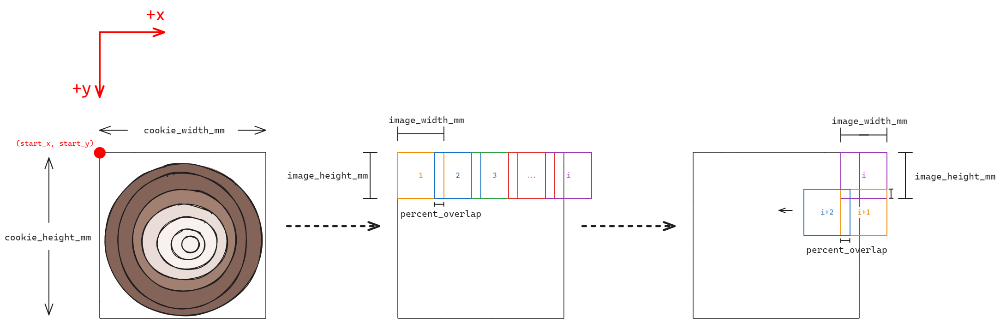
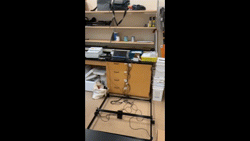

# TreeRings

The TreeRings project is under development by students in the Temporal Ecology Lab at UBC. The project aims to create an open source and reproducible system to digitize ultra high resolution images of tree cookies. This is accomplished with a robot having control of a microscope camera that can navigate the X, Y, and Z directions. By systematically capturing images across the surface of the cookie, it is possible to stitch subframes of the cookie together into one large mosaic with the help of feature matching techniques. 

While this was designed to capture tree cookies, in theory this should also be able to be used to scan other planar objects such as planed mineral samples or pencil drawings. 

## Getting Started TODO

These instructions will get you a copy of the project up and running on your local machine for development and testing purposes. See deployment for notes on how to deploy the project on a live system.

### Prerequisites / Equipment

| Item | Description | Number | Cost per unit CAD | Total cost | Source | Material Type |
| ---  |     ---     |  --- | --- | --- | --- | --- |
| FDM 3D Printer | Many components are 3D printed to allow for rapid prototyping. Printing quality varies across platforms and materials. Choose what is best for your lab - our parts were made with a [Bambu Carbon X1](https://ca.store.bambulab.com/products/x1-carbon?variant=46286179270896&currency=CAD&utm_medium=product_sync&utm_source=google&utm_content=sag_organic&utm_campaign=sag_organic&gad_source=1&gclid=Cj0KCQjww5u2BhDeARIsALBuLnPN2AA2AAOx9SfhR0Slt6G1aFqrriQxQIsDFw2W-HsvmBLvWzmlFU4aAoNQEALw_wcB) printer. |  --- | --- | --- | --- | --- |
| [Jetson Orin Nano](https://www.seeedstudio.com/NVIDIAr-Jetson-Orintm-Nano-Developer-Kit-p-5617.html?gad_source=1&gclid=Cj0KCQjww5u2BhDeARIsALBuLnM4tGqXsBM7JNxW5mwzGraFG74Qjp_JeM_HpbXGEc9Mlnl9b1s2fv8aAsPREALw_wcB) | This acts as the main computing device, running the GUI, stitching software, driving the camera, etc. |  --- | --- | --- | --- | --- |
| [1 TB NVME SSD](https://www.amazon.ca/dp/B09QV692XY?ref=ppx_yo2ov_dt_b_fed_asin_title) | For storage on the Jetson. |  --- | --- | --- | --- | --- |
| [OpenBuilds Acro](https://openbuilds.com/builds/openbuilds-acro-system.5416/) | The chassis for the gantry robot has already been designed and greatly documented by OpenBuilds. Building on top of this system has many benefits such as a library of documentation and customer service! |  --- | --- | --- | --- | --- |
| [OpenBuilds BlackBox X32](https://openbuildspartstore.com/BlackBox-Motion-Control-System-X32) | The motor controller to convert G-Code commands into electrical signals for the stepper motors. This was originally an Arduino - with a CNC hat and GRBL firmware. Sadly this quickly became a mess of wires and lacked the robust and clean wiring that the BlackBox has out of the box. |  --- | --- | --- | --- | --- |
| [Raspberry Pi HQ Camera](https://www.digikey.ca/en/products/detail/raspberry-pi/SC1220/12339164?utm_adgroup=&utm_source=google&utm_medium=cpc&utm_campaign=PMax%20Product_Low%20ROAS%20Categories&utm_term=&productid=12339164&utm_content=&utm_id=go_cmp-20291741422_adg-_ad-__dev-c_ext-_prd-12339164_sig-Cj0KCQjww5u2BhDeARIsALBuLnPqCH09hu75KK18zBjZjUBQatUt-5BTpTnjI5q8qJso41ViaZUtn34aAnrvEALw_wcB&gad_source=1&gclid=Cj0KCQjww5u2BhDeARIsALBuLnPqCH09hu75KK18zBjZjUBQatUt-5BTpTnjI5q8qJso41ViaZUtn34aAnrvEALw_wcB) | The Raspberry Pi HQ camera is guaranteed to be made for a few more years. It is also a cheap and convenient alternative to a professional camera. Although this lacks built in autofocus, making the control of the system long. |   --- | --- | --- | --- | --- |
| [Seeed Studio 100x C-Mount Lens](https://www.mouser.ca/ProductDetail/Seeed-Studio/114992279?qs=sPbYRqrBIVkEZBNsZalWRw%3D%3D&mgh=1&utm_id=17633666059&gad_source=1&gclid=Cj0KCQjww5u2BhDeARIsALBuLnODICm5ko0IUJuMAPNL5cLVtKh6Wy707Y80PBOfuO5cLn4FYl5yqvsaAvkBEALw_wcB) | This lens has variable focal lengths allowing for easy adjustment of amount of the detail desired while capturing the images. |   --- | --- | --- | --- | --- |
| [Ring light for lens](https://www.amazon.ca/dp/B0B1JQLXG7?ref=ppx_yo2ov_dt_b_fed_asin_title) | Conveniently fits on the Seeed studio lens |  --- | --- | --- | --- | --- |
| USB / Wireless Keyboard | Generic |  --- | --- | --- | --- | --- |
| USB / Wireless Mouse | Generic |  --- | --- | --- | --- | --- |
| USBC Flash Drive | Generic, for transferring files from the device to your main computer. |  --- | --- | --- | --- | --- |
| Display Port to HDMI adapter | Any adapter should work if using a HDMI monitor |  --- | --- | --- | --- | --- |
| Monitor | Computer monitor of some sort to use the GUI. |   --- | --- | --- | --- | --- |
| 3m HDMI Cord | Generic |  --- | --- | --- | --- | --- |
| 3m USB-B to USB-A Cord | Generic |  --- | --- | --- | --- | --- |
| [Corner brackets](https://www.amazon.ca/dp/B09YGJMNBP?ref=ppx_yo2ov_dt_b_fed_asin_title&th=1) for aluminum extrusion | Used for making stronger, and taller legs for the Acro |  --- | --- | --- | --- | --- |
| [20mm x 20mm x 250mm V-Slot Aluminum](https://www.amazon.ca/dp/B0CL49ZGZX?ref=ppx_yo2ov_dt_b_fed_asin_title) | Used for extending the height of the Acro. Can be any V slot extrusion |  --- | --- | --- | --- | --- |


### Installing TODO

A step by step series of examples that tell you how to get a development env running

Say what the step will be

```
Give the example
```

And repeat

```
until finished
```

End with an example of getting some data out of the system or using it for a little demo

## Running the tests TODO

Explain how to run the automated tests for this system

### Break down into end to end tests TODO

Explain what these tests test and why

```
Give an example
```

### And coding style tests TODO 

Explain what these tests test and why

```
Give an example
```

## Deployment TODO

Add additional notes about how to deploy this on a live system

## Built With TODO

* [Dropwizard](http://www.dropwizard.io/1.0.2/docs/) - The web framework used
* [Maven](https://maven.apache.org/) - Dependency Management
* [ROME](https://rometools.github.io/rome/) - Used to generate RSS Feeds

## Contributing TODO

Please read [CONTRIBUTING.md](https://gist.github.com/PurpleBooth/b24679402957c63ec426) for details on our code of conduct, and the process for submitting pull requests to us.

## Versioning TODO 

We use [SemVer](http://semver.org/) for versioning. For the versions available, see the [tags on this repository](https://github.com/your/project/tags). 

## Authors TODO

* **Billie Thompson** - *Initial work* - [PurpleBooth](https://github.com/PurpleBooth)

See also the list of [contributors](https://github.com/your/project/contributors) who participated in this project.

## License TODO

This project is licensed under the MIT License - see the [LICENSE.md](LICENSE.md) file for details

## Acknowledgments TODO

* Hat tip to anyone whose code was used
* Inspiration
* etc

## Serpentine G-Code Control Logic


