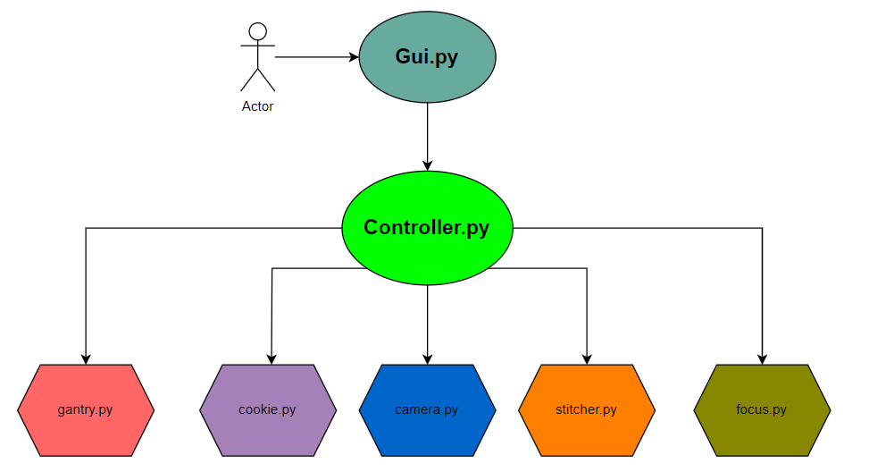

# Software Schema

This project uses many files to separate functionality. None of the code can run unless it is on a Jetson Orin Nano with the packages, hardware, and other peripherals installed as described in the GitHub repository. Functionality can be best tracked by starting in the 'gui.py' file and using the Shift+click function in VS Code to follow where functions are defined in the project.

The system is started using:

`python gui.py`