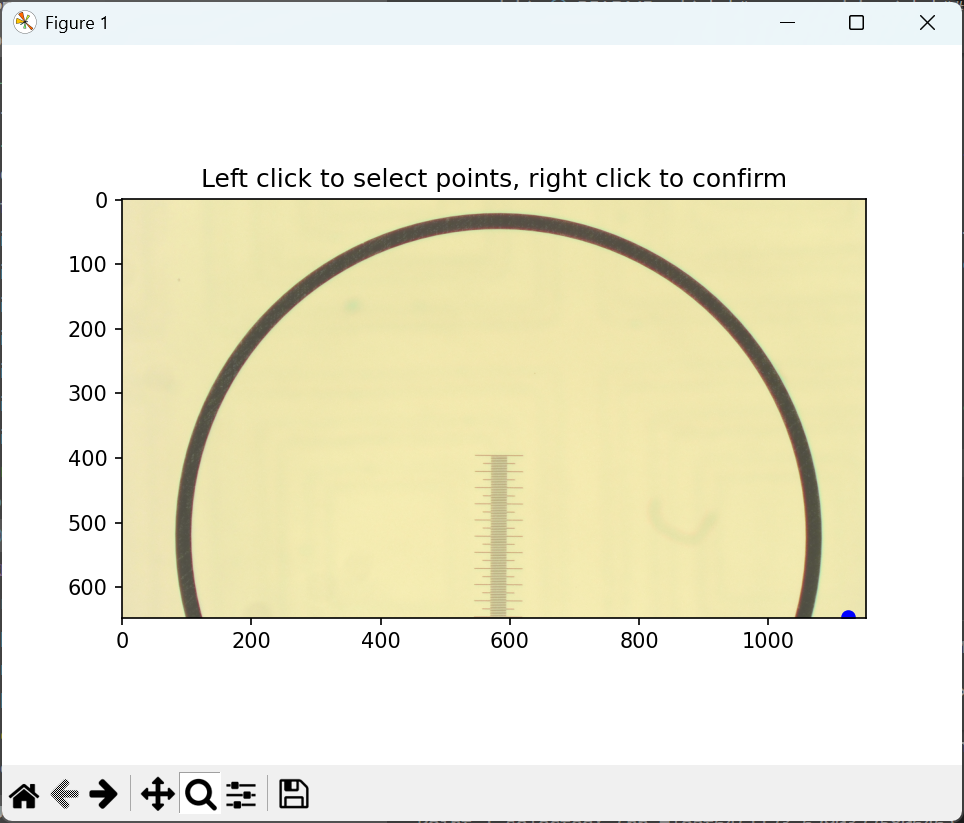
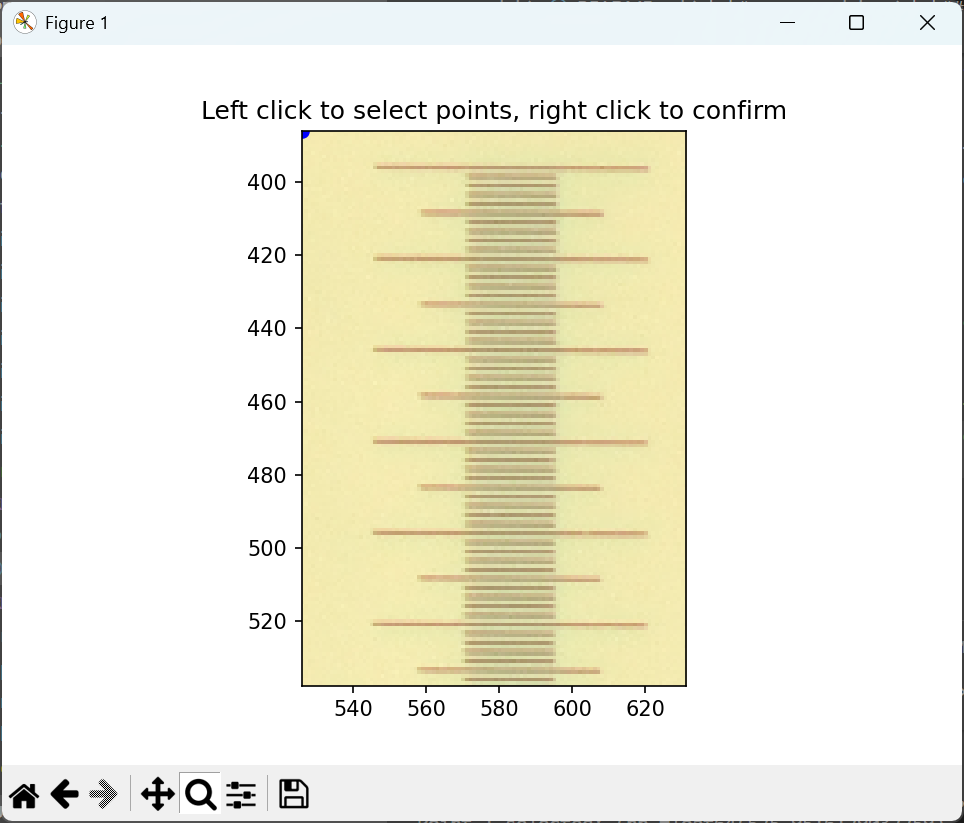
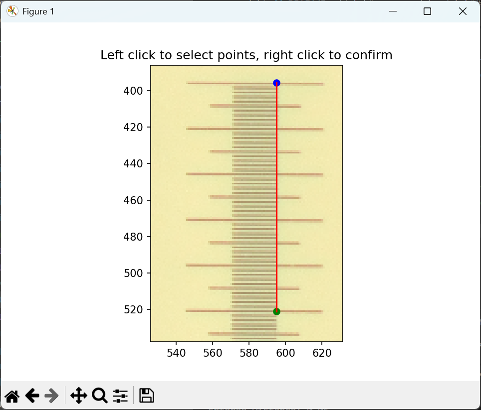

# measure_dpi.py

Measuring DPI is very important to find the ratio between pixels and distance in your images. So long as the lens doesn't move, the DPI doesn't change unless you change the downscale percentage in config.json. All of that information is stored in the metadata alongside the stitched scans.

For sanity checking and redundancy, this script can be used strategically. You can take a calibration photo of a slide ruler with 0.01 mm graduations and save it in the same folder that you save the scans. With the images of the ruler, you will be able to manually check the DPI using a GUI tool, measure_dpi.py

The idea is that you need to measure something on the screen that you know the distance of. For example, set the DISTANCE_MM to 0.05mm and click two points that are 0.05mm apart. The terminal that you ran the python script from will print the DPI. Make sure that you are clicking.

## Steps

1. Change the filepath and known measurement of `measure_dpi.py`.
2. Run `python measure_dpi.py` and make sure you're in the right directory for file referencing.
3. The scale should look something like this. It's better to have the scale centered in the frame but the DPI is about the same throughout the frame. 
4. Use the magnification tool at the bottom left of the frame and zoom into the image to help you know you are clicking the exact pixel you want. Feel free to zoom in further than the example image and pick the exact pixel where you think the graduation starts. 
5. Click your known distance. Left click registers a point, and if you're happy with where you clicked, use the right click to save. You can make an infinite amount of lines on the same picture so don't worry if you make a mistake. Only record DPI values that you are confident in. Make sure you use the same side of the graduation line and draw your line perpendicularly to each graduation. 
6. It's a good idea to repeat this a couple of times and converge on a mean.